[![Contributors][contributors-shield]][contributors-url]
[![Forks][forks-shield]][forks-url]
[![Stargazers][stars-shield]][stars-url]
[![Issues][issues-shield]][issues-url]
[![MIT License][license-shield]][license-url]
[![LinkedIn][linkedin-shield]][linkedin-url]
<a name="readme-top"></a>

<br />
<div align="center">
<h3 align="center">Oddam w Dobre Ręce</h3>

  <p align="center">
    "Oddam w Dobre Ręce" is a platform designed to create a trustworthy space where individuals can donate items they no longer need to verified institutions.    <br />
    <a href="https://github.com/mateuszmarc/Charity-Donation-App"><strong>Explore the docs »</strong></a>
    <br />
    <br />
    <a href="https://github.com/mateuszmarc/Charity-Donation-App">View Demo</a>
    ·
    <a href="https://github.com/mateuszmarc/Charity-Donation-App/issues/new?labels=bug&template=bug-report---.md">Report Bug</a>
    ·
    <a href="https://github.com/mateuszmarc/Charity-Donation-App/issues/new?labels=enhancement&template=feature-request---.md">Request Feature</a>
  </p>
</div>


<!-- TABLE OF CONTENTS -->
<details>
  <summary>Table of Contents</summary>
  <ol>
    <li>
      <a href="#about-the-project">About The Project</a>
      <ul>
        <li><a href="#built-with">Built With</a></li>
        <li><a href="#implementation">Implementation</a></li>
      </ul>
    </li>
    <li>
      <a href="#getting-started">Getting Started</a>
      <ul>
        <li><a href="#prerequisites">Prerequisites</a></li>
        <li><a href="#installation">Installation</a></li>
      </ul>
    </li>
    <li>
<a href="#usage">Usage</a>
      <ul>
        <li><a href="#user-role-system-description">User Role System Description</a></li>
<ul>
        <li><a href="#types-of-users">Types of Users</a></li>
        <li><a href="#benefits-of-this-system">Benefits of the System</a></li>
        <li><a href="#how-the-role-system-works">How the Role System works</a></li>
</ul>
        <li><a href="#for-all-users">For all users</a></li>
<ul>
        <li><a href="#home-page">Home page</a></li>
        <li><a href="#create-an-account">Create account</a></li>
<ul>
        <li><a href="#step-1-access-the-registration-page">Step 1: Access the Registration Page</a></li>
        <li><a href="#step-2-fill-out-the-registration-form">Step 2: Fill Out the Registration Form</a></li>
        <li><a href="#step-3-handle-validation-errors">Step 3: Handle Validation Errors</a></li>
        <li><a href="#step-4-registration-confirmation">Step 4: Registration Confirmation</a></li>
</ul>
        <li><a href="#login-and-logout">Login and Logout</a></li>
        <li><a href="#reset-password">Reset Password</a></li>
</ul>
        <li><a href="#user-specific-features">User-Specific Features</a></li>
<ul>
        <li><a href="#account-management">Account Management</a></li>
        <li><a href="#create-a-donation">Create a Donation</a></li>
        <li><a href="#view-donation-history">View Donation History</a></li>
        <li><a href="#profile-management">Profile Management</a></li>
</ul>
        <li><a href="#administrator-features">Administrator Features</a></li>
<ul>
        <li><a href="#user-management">User Management</a></li>
        <li><a href="#institution-management">Institution Management</a></li>
        <li><a href="#donation-management">Donation Management</a></li>
        <li><a href="#category-management">Category Management</a></li>
</ul>
        <li><a href="#page-not-found">Brak zasobu</a></li>
</ul>
</li>
    <li><a href="#issues">Issues</a></li>
    <li><a href="#contributing">Contributing</a></li>
    <li><a href="#license">License</a></li>
    <li><a href="#contact">Contact</a></li>
    <li><a href="#thoughts-and-future-extensions">Thoughts and future extensions</a></li>
  </ol>
</details>


<!-- ABOUT THE PROJECT -->

## About The Project


The main goal is to address the common issue of unused but good-quality items cluttering households. These items can
still be of great use to others, yet there is no simple and reliable way to donate them.

Many people have items at home that they no longer use but are still in good condition. They would like to give these
items to those in need but face several challenges:

* Lack of Trust: Existing options often lack transparency, making users uncertain about whether their donations will
  truly reach those in need.
* Inconvenience: Trusted donation centers often require the donor to physically drop off items, which can be
  time-consuming and impractical for those without transportation.
* Unverified Alternatives: Local donation bins or collections near homes are unregulated, leaving users unsure if their
  items will be used for charitable purposes.

This platform tries to fix those issues by simplifying a donation process of unused things.

### Built With

* [![html5][html.com]][html5-url]
* [![css][css.com]][css-url]
* [![javascript][javascript.com]][javascript-url]
* [![spring-boot][spring-boot.com]][spring-boot-url]
* [![hibernate][hibernate.com]][hibernate-url]
* [![springSecurity][spring-security.com]][spring-security-url]
* [![thymeleaf][thymeleaf.com]][thymeleaf-url]

<p align="right">(<a href="#readme-top">back to top</a>)</p>

### Implementation

Project is build using a Spring-Boot framework.
JPA is implemented using Hibernate ORM.
The Model is rendered using Thymeleaf templating engine.
Security is provided by using Spring-Boot-Security.

<p align="right">(<a href="#readme-top">back to top</a>)</p>

<!-- GETTING STARTED -->

## Getting Started

### Prerequisites

You don't need much to use this app but below might help

* Code editor, for example, [intelliJ](https://www.jetbrains.com/idea/)
* Installed [MySql](https://www.mysql.com/)
* Installed [Java JDK](https://www.java.com/pl/)

### Installation

1. Clone the repo
   ```sh
   git clone https://github.com/mateuszmarc/Charity-Donation-App.git
   ```
2. Open the project in IntelliJ IDEA.
3. Setup datasource properties in application properties.
4. Run sql script
   ```sh
    sql-sqripts/script-01.sql
    ```
5. Run application:
   It will create the first admin user whose email is 'admin@admin.com' and password is 'Admin123!'.
6. Enter endpoint ```localhost:8080/app```
7. Once login to application, change password and email to your real one.

<p align="right">(<a href="#readme-top">back to top</a>)</p>


<!-- USAGE EXAMPLES -->

## Usage

## User Role System Description

The application supports a flexible role-based user system to cater to different functionalities and responsibilities.
There are two types of users: those with the admin role and those with the user role. A user can possess both roles, enabling them to donate items and administer the platform.
Below is a description of the role system:

### Types of Users:

1. User with ```ROLE_USER``` Role:
    * Primary role for general users.
        * Can create donations.
        * View their donation history and details.
        * Manage their personal profile and account settings.

2. User with ```ROLE_ADMIN``` Role:
    * Administrative role for managing the platform.
        * Manage users:
        * Edit, block, or delete user accounts.
        * Assign or revoke roles.
        * Manage institutions:
        * Add, edit, or delete institutions.
        * Oversee donations:
        * View, archive, or delete donations.
        * Manage donation categories.
        * Add, edit, or delete categories.

3. User with Both ```ROLE_USER``` and ```ROLE_ADMIN``` Roles:
    * A versatile user who combines the functionalities of both roles.
        * All actions allowed under the USER role, including creating donations.
        * All actions allowed under the ADMIN role, including user and institution management.

#### Benefits of this System

1. Flexibility:
    * Enables one account to serve both general user and administrative purposes.
2. Simplicity:
    * Eliminates the need for separate accounts for donations and administration.
3. Scalability:
    * Easily extendable to support new roles or additional permissions in the future.

#### How the Role System Works

* Role Assignment:
    * Roles are assigned during user registration or by an admin after account creation.
    * Users can have one or both roles simultaneously.
* Dynamic Access Control:
    * The application dynamically checks the roles assigned to the user and displays options or features accordingly.
        * Example:
            * A user with only the USER role sees donation-related options.
            * A user with the ADMIN role gains access to administrative panels.
              * If the users want to access resources they are not authorized to, they will be denied:
              
                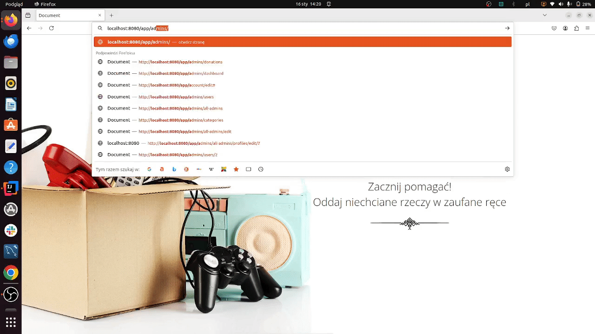
                
              
            * A user with both roles can switch seamlessly between managing donations and administrative tasks.
              

### For All Users

### Home Page

* View information about the platform and its purpose
* Browse verified institutions accepting donations
* Access statistics about total donations and donation bags collected.
* Contact with people responsible for the platform.


### Create an Account

##### Step 1: Access the Registration Page

Navigate to the "Register" page by clicking the "Załóż konto" (Create Account) link on the homepage or directly visiting
the registration URL (e.g., /register).

##### Step 2: Fill Out the Registration Form

Complete the required fields in the registration form:


1. **Email Address**:
   Enter a valid email address in the "Email" field.
   Example: example@email.com.
2. **Password**:
   Create a strong password that complies with the password rules displayed under the password input field.
   Enter the password in the "Hasło" (Password) field.
3. **Confirm Password**:
   Re-enter the same password in the "Powtórz hasło" (Repeat Password) field.

##### Step 3: Handle Validation Errors

If there are any validation errors (e.g., invalid email format, mismatched passwords, or a weak password):
Review the error messages displayed in red under the respective fields.
Correct the errors and re-submit the form. If entered email is already registered, then you will be informed about it.

##### Step 4: Registration Confirmation
After successfully submitting the registration form, you will be redirected to the Registration Confirmation page.
Confirm registration by clicking on a generated link that was sent to given email.
Once clicked in a verification link user account will get activated


Link is active for a particular amount of time. After expiration user will get friendly information and possibility to
generate a new link

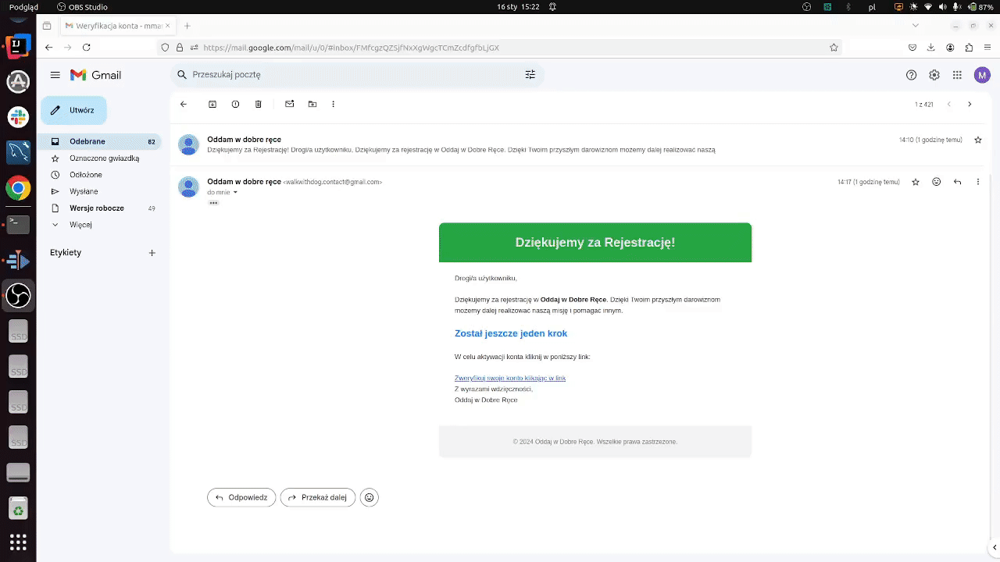

If a user changes a token in a verification link, the account will not get authenticated


If an authenticated user clicks on the verification link, then he will get information about an active account

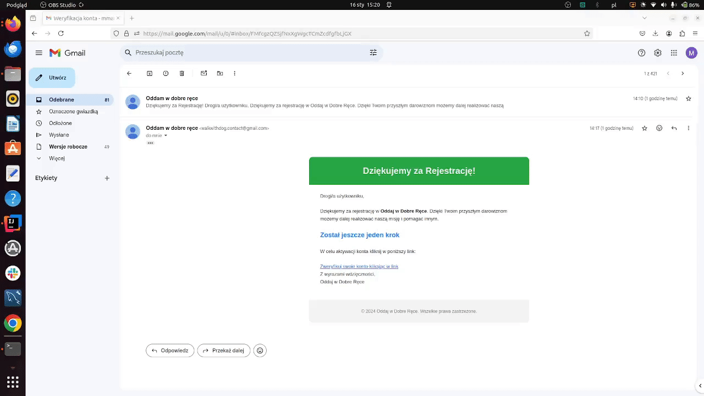

### Login and Logout

* Authenticate to access additional features
* Securely log out from the application.

### Reset Password

* Allows users to request a password reset link by providing their registered email address.
  Change the password via a secure token-based process.
  If the user enters an email not registered in the portal, he will get friendly information:

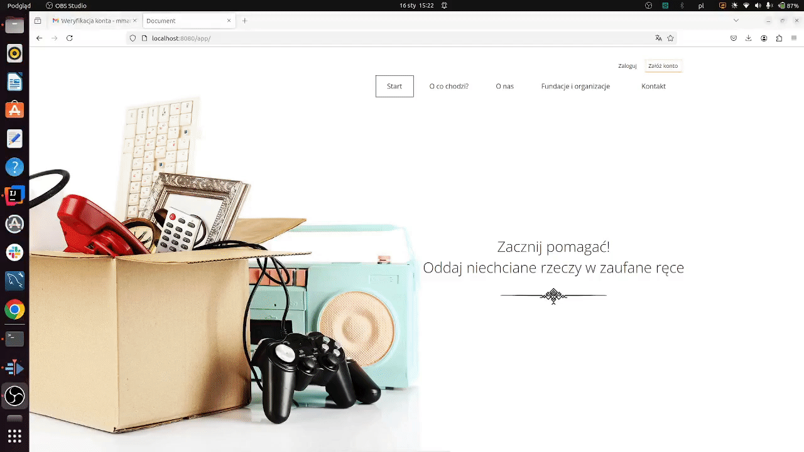
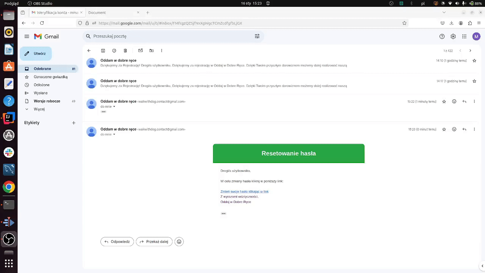


### Message Sending 
* Unauthenticated users and users with `USER` role can send contact messages to application moderators


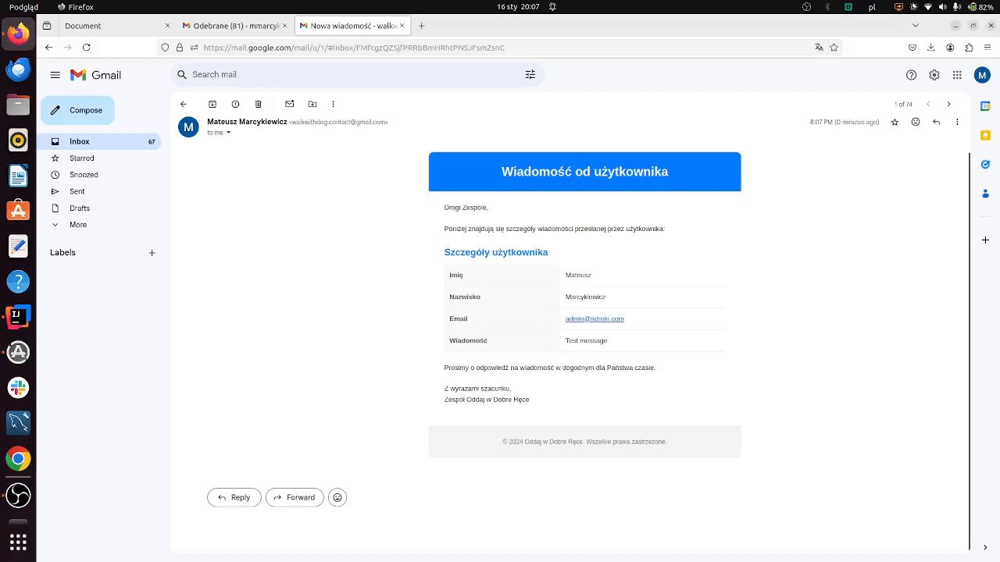

### User-Specific Features

### Account Management

* Registration: Users can register a new account by providing an email address, password, and confirming their password.
* Login/Logout: Secure authentication with logout options for better session control.
* Password Reset: Request a reset link via email by entering the registered email address on the reset form.
  Set a new password through the secure reset link provided via email

#### Create a Donation

* Users can complete a form to donate items, specifying categories, quantities, and pickup details
    * Donation categories:
    * Quantity of donation:
    * Institution the donation will go to
    * Pick up details
      Once donation multistep form completed user will see summary of his donation:
    * If donation fields are properly populated with necessary data, the user will get information about his donation on
      email.
* If any donation step is skipped or wrong data is provided, the user will receive information to fix and resubmit the
  donation form:


#### View Donation History

* Access a list of all donations that are possible to sort
* See details of every donation
* Mark Donations as Received: Confirm that donated items have been successfully picked up.

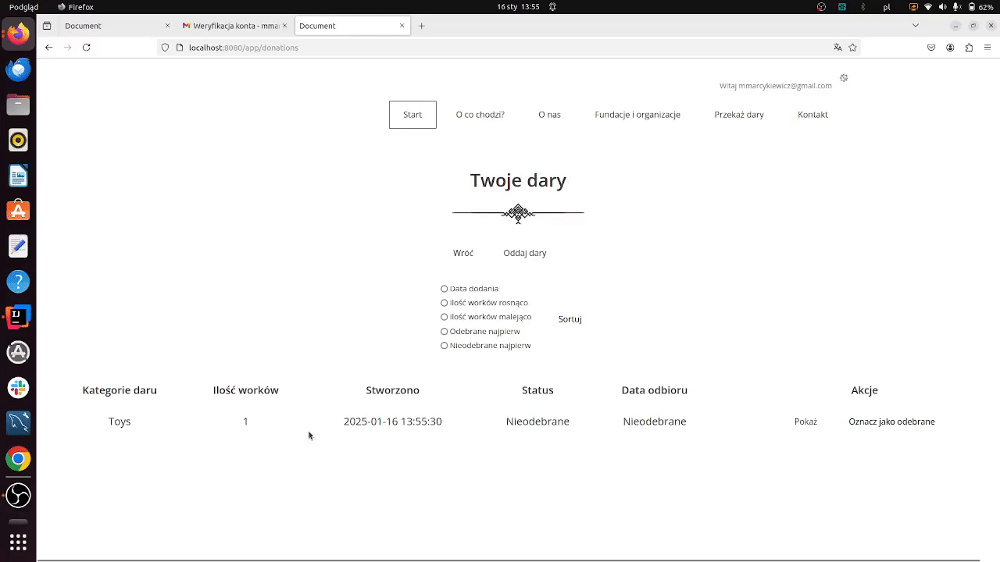

#### Profile Management

* Profile Management: Update user details, including profile information and account settings

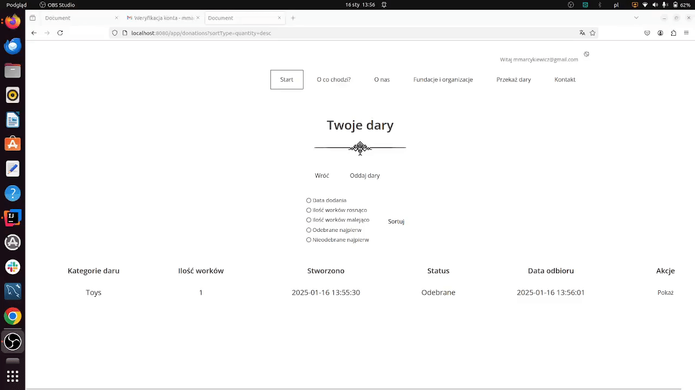
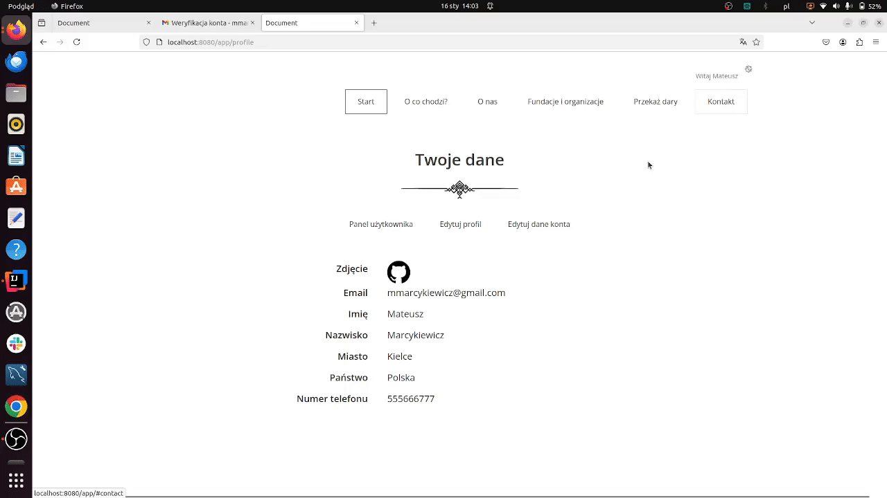
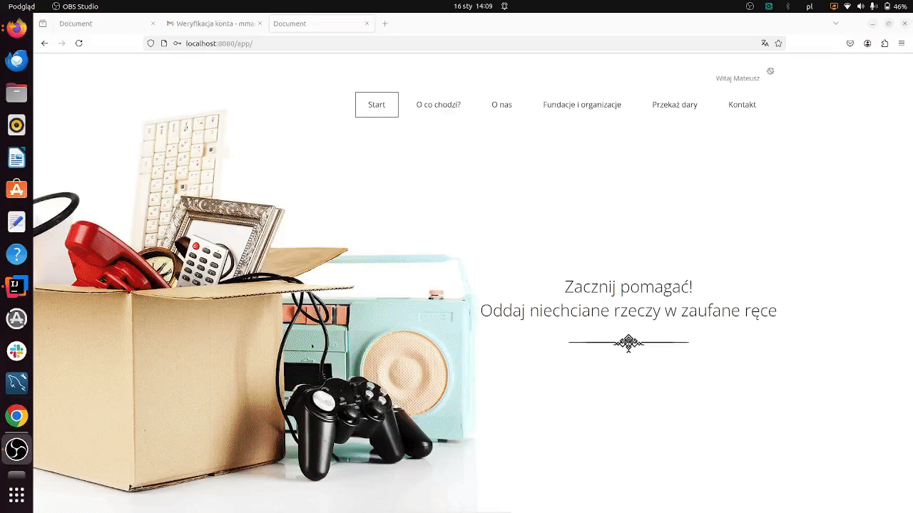

* Users regardless of the role can delete their own account

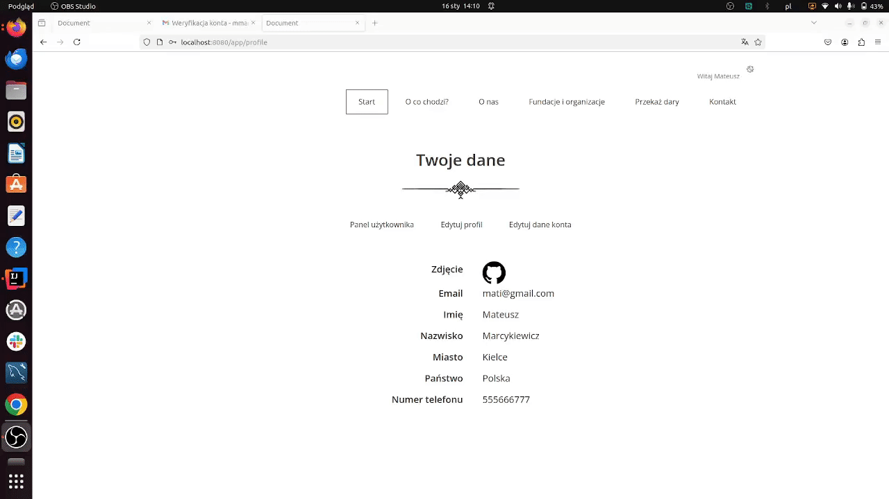

* If Admin wants to delete account or downgrade himself, first he has to assign an ADMIN role to someone else

## Administrator Features


### User Management
* View a list of all regular users and admin users.
* View user account details
* View user profile details
* Edit user account details
* Edit user profile details
* Block/unblock accounts, or delete users.
* Assign or revoke administrator roles for users.


### Institution Management
* View and manage institutions:
* View institution details
* Edit institution
* Delete institution
* Add an institution


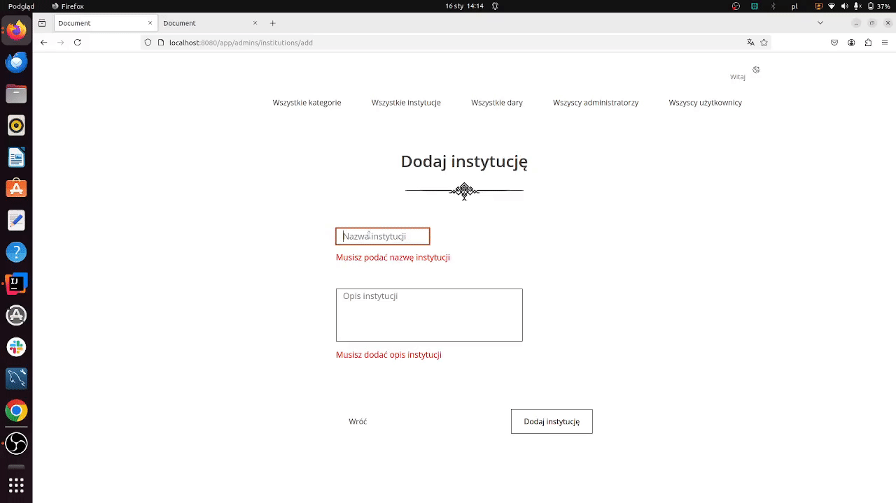

### Donation Management
* View all donations with sorting options to track user activity and manage pickups
* View donation details
* Archive or delete donations as needed.


### Category Management

* View all categories
* View category details
* Edit category
* Delete category
* Add category


<p align="right">(<a href="#readme-top">back to top</a>)</p>

### Page Not Found
The application implements a custom error handling mechanism for HTTP 404 (Page Not Found) errors to improve user experience and maintain consistency in the user interface.

[![page-not-found][page-not-found]](readme-images/page-not-found.png)


## Issues
See the [open issues](https://github.com/mateuszmarc/Workshop5/issues) for a full list of proposed features (and known
issues).

<p align="right">(<a href="#readme-top">back to top</a>)</p>


<!-- CONTRIBUTING -->

## Contributing

Contributions are what make the open source community such an amazing place to learn, inspire, and create. Any
contributions you make are **greatly appreciated**.

If you have a suggestion that would make this better, please fork the repo and create a pull request. You can also
simply open an issue with the tag "enhancement".
Don't forget to give the project a star! Thanks again!

1. Fork the Project
2. Create your Feature Branch (`git checkout -b feature/AmazingFeature`)
3. Commit your Changes (`git commit -m 'Add some AmazingFeature'`)
4. Push to the Branch (`git push origin feature/AmazingFeature`)
5. Open a Pull Request

<p align="right">(<a href="#readme-top">back to top</a>)</p>


<!-- LICENSE -->

## License

Distributed under the MIT License. See `LICENSE` for more information.

<p align="right">(<a href="#readme-top">back to top</a>)</p>


<!-- CONTACT -->

## Contact

Mateusz Marcykiewicz - mmarcykiewicz@gmail.com

Project Link: [https://github.com/mateuszmarc/Charity-Donation-App](https://github.com/mateuszmarc/Workshop5)

<p align="right">(<a href="#readme-top">back to top</a>)</p>

## Thoughts and future extensions

In the future, a project can be extended by following features:

* Validation by JavaScript of donation form steps

And adding tests for application is what I will do next for this project.

<p align="right">(<a href="#readme-top">back to top</a>)</p>


<!-- MARKDOWN LINKS & IMAGES -->
<!-- https://www.markdownguide.org/basic-syntax/#reference-style-links -->

[contributors-shield]: https://img.shields.io/github/contributors/mateuszmarc/Charity-Donation-App.svg?style=for-the-badge

[contributors-url]: https://github.com/mateuszmarc/Charity-Donation-App/graphs/contributors

[forks-shield]: https://img.shields.io/github/forks/mateuszmarc/Charity-Donation-App.svg?style=for-the-badge

[forks-url]: https://github.com/mateuszmarc/Charity-Donation-App/network/members

[stars-shield]: https://img.shields.io/github/stars/mateuszmarc/Charity-Donation-App.svg?style=for-the-badge

[stars-url]: https://github.com/mateuszmarc/Charity-Donation-App/stargazers

[issues-shield]: https://img.shields.io/github/issues/mateuszmarc/Charity-Donation-App.svg?style=for-the-badge

[issues-url]: https://github.com/mateuszmarc/Charity-Donation-App/issues

[license-shield]: https://img.shields.io/github/license/mateuszmarc/Charity-Donation-App.svg?style=for-the-badge

[license-url]: https://github.com/mateuszmarc/Charity-Donation-App/blob/main/LICENSE

[linkedin-shield]: https://img.shields.io/badge/-LinkedIn-black.svg?style=for-the-badge&logo=linkedin&colorB=555

[linkedin-url]: https://www.linkedin.com/in/mateusz-marcykiewicz/

[javascript.com]: https://img.shields.io/badge/javascript-icon?style=for-the-badge&logo=javascript&logoColor=%23F7DF1E&color=black

[javascript-url]: https://javascript.com

[html.com]: https://img.shields.io/badge/html-icon?style=for-the-badge&logo=html5&logoColor=%23E34F26&color=black

[html5-url]: https://html.com/

[css-url]: https://developer.mozilla.org/en-US/docs/Web/CSS

[css.com]: https://img.shields.io/badge/CSS-blue?logo=css3&logoColor=white

[spring-boot.com]: https://img.shields.io/badge/Spring%20Boot-green?logo=springboot&logoColor=white

[spring-boot-url]: https://spring.io/projects/spring-boot

[hibernate.com]: https://img.shields.io/badge/Hibernate-orange?logo=hibernate&logoColor=white

[hibernate-url]: https://hibernate.org/

[spring-security.com]: https://img.shields.io/badge/Spring%20Security-green?logo=springsecurity&logoColor=white

[spring-security-url]: https://spring.io/projects/spring-security

[thymeleaf.com]: https://img.shields.io/badge/Thymeleaf-brightgreen?logo=thymeleaf&logoColor=white

[thymeleaf-url]: https://www.thymeleaf.org/


[page-not-found]: readme-images/page-not-found.png
